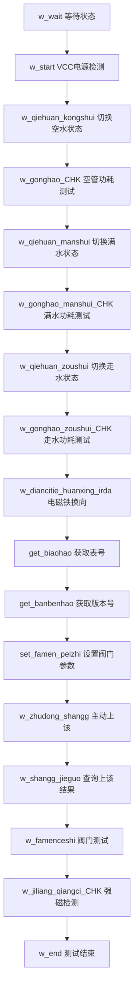

# 水表测试系统运作模式详解

## 系统架构概述

这是一个**嵌入式自动化测试系统**，用于检测小口径超声波水表的各项功能和性能指标。

## 核心运作模式

### 1. 主循环结构
```c
int main(void) {
    // 系统初始化
    test_Init();

    while (1) {
        // 串口数据接收处理
        Uart3_Rx_rec();  // 计量模块通信
        Uart4_Rx_rec();  // 红外通信
        Uart1_Rx_rec();  // 水表通信
        Uart0_Rx_rec();  // PC上位机通信

        // LED状态显示
        LED_FLAG_LOOP();

        // 测试流程控制
        test_Loop_Func();  // 主测试状态机
        Test_loop_func();  // 辅助测试功能

        // 看门狗喂狗
        FL_IWDT_ReloadCounter(IWDT);
        LED_On();
    }
}
```

### 2. 测试状态机流程

系统使用**状态机模式**控制整个测试流程：



## 关键组件功能

### 1. 通信系统
| 串口 | 功能 | 通信对象 |
|------|------|----------|
| UART0 | PC上位机通信 | 测试结果上传、参数配置 |
| UART1 | 水表模块通信 | F003协议查询、控制指令 |
| UART3 | 计量模块通信 | 计量功能测试 |
| UART4 | 红外通信 | 红外功能测试 |

### 2. 测试控制逻辑

#### 电源检测
```c
case w_start:
    Test_jiejuo_jilu.zhidian_dianya_gongdian = get_zhukongban_gongdian_dianya();
    if (Test_jiejuo_jilu.zhidian_dianya_gongdian > 3200 &&
        Test_jiejuo_jilu.zhidian_dianya_gongdian < 4000) {
        // 电压合格，进入下一步
        Test_liucheng_L = w_qiehuan_kongshui;
    }
```

#### 功耗测试循环
```c
case w_gonghao_CHK:
    Test_jiejuo_jilu.zhidian_jingtai_gonghao = Current_CHK_Func(0);
    if (Test_jiejuo_jilu.zhidian_jingtai_gonghao > 2 &&
        Test_jiejuo_jilu.zhidian_jingtai_gonghao < 30) {
        // 功耗合格，进入下一步
        Test_liucheng_L = w_qiehuan_manshui;
    }
```

#### 协议通信
```c
case get_biaohao:
    if (test_xieyi_jilu_Rec == w_get_biaohao) {
        // 成功获取表号
        Test_liucheng_L = get_banbenhao;
    } else {
        // 发送读取表号协议
        find_biaohao_xieyi();
    }
```

### 3. 时间控制机制

#### 软件延时
```c
struct Test_quanju_canshu {
    uint16_t time_softdelay_ms;        // 软件延时
    uint32_t time_aroundtest_ms;       // 全程测试超时
    uint16_t danbu_chaoshishijian_ms;  // 单步超时时间
    uint8_t test_over;                 // 测试结束标志
};
```

#### 超时保护
```c
void test_err_end_Func() {
    if ((Test_quanju_canshu_L.time_aroundtest_ms == 0 ||
         Test_quanju_canshu_L.danbu_chaoshishijian_ms == 0) &&
        Test_quanju_canshu_L.test_over == 0) {
        // 超时错误，结束测试
        test_testend();
    }
}
```

## 测试项目详解

### 1. 功耗测试序列
1. **空管功耗** (`w_gonghao_CHK`) - 管道无水状态功耗
2. **满水功耗** (`w_gonghao_manshui_CHK`) - 管道满水状态功耗
3. **走水功耗** (`w_gonghao_zoushui_CHK`) - 水流通过时功耗

### 2. 通信功能测试
1. **表号获取** - 验证设备标识
2. **版本号获取** - 确认固件版本
3. **F003协议查询** - 获取全面设备状态

### 3. 机械功能测试
1. **阀门控制** - 阀门开关功能
2. **位置检测** - 阀门到位信号
3. **强磁检测** - 防磁干扰功能

## 数据流向

### 输入数据流
```
PC上位机 → UART0 → 测试参数配置
水表设备 → UART1 → F003协议返回数据
计量模块 → UART3 → 计量状态数据
红外模块 → UART4 → 红外通信数据
```

### 输出数据流
```
测试结果 → UART0 → PC上位机
控制指令 → UART1 → 水表设备
计量控制 → UART3 → 计量模块
红外控制 → UART4 → 红外模块
```

## 关键设计特点

### 1. 非阻塞架构
- 主循环持续运行，不会阻塞
- 使用软件延时代替硬件延时
- 状态机确保流程有序进行

### 2. 错误处理机制
- 超时保护避免死锁
- 重试机制提高可靠性
- 错误状态自动恢复

### 3. 模块化设计
- 每个功能独立封装
- 串口通信统一管理
- 测试流程可配置

### 4. 实时性保证
- 看门狗防止系统死机
- 及时响应串口数据
- 快速状态切换

这个系统设计非常适合**工业自动化测试**场景，具备高可靠性、易维护性和扩展性的特点。

---
*分析时间：2025年8月27日*
*系统版本：v1.0*
